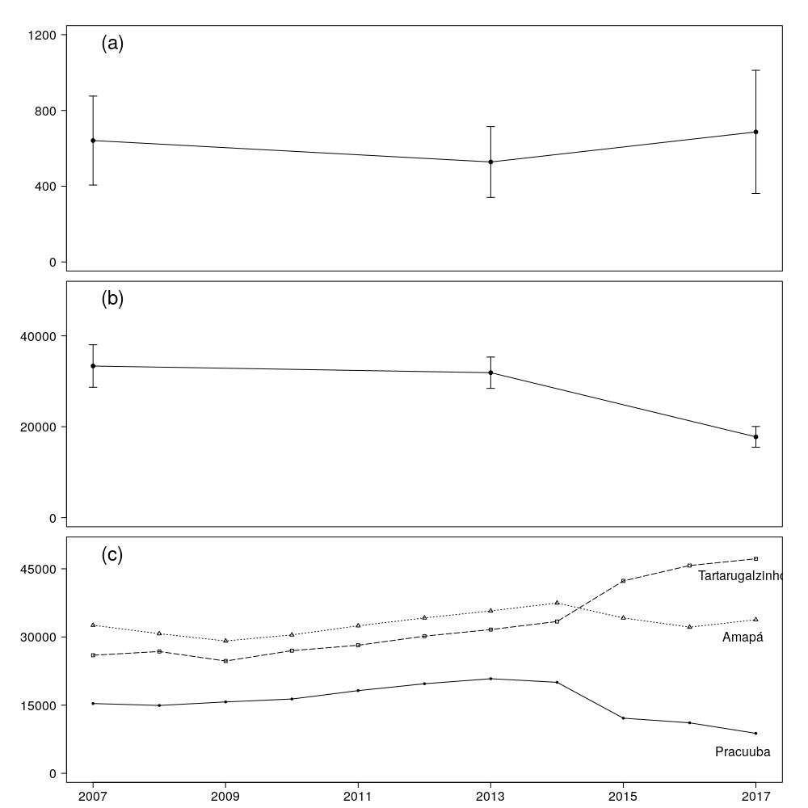

# Buffalo

Code to analyze data from aerial counts of buffaloes at Lago Piratuba Biological Reserve and Maracá-Jipioca Ecological Station.
By Elildo Carvalho Jr @ ICMBio/CENAP

Aerial counts (double-count technique) conducted in December 2017 by Elildo Carvalho Jr, Henrique Gonçalves, Iranildo Coutinho and Patricia Pinha.

**Figure 1.** Observed densities of buffalo at Lago Piratuba Biological Reserve, Amapá:

**Figure 2.** Population trends:

