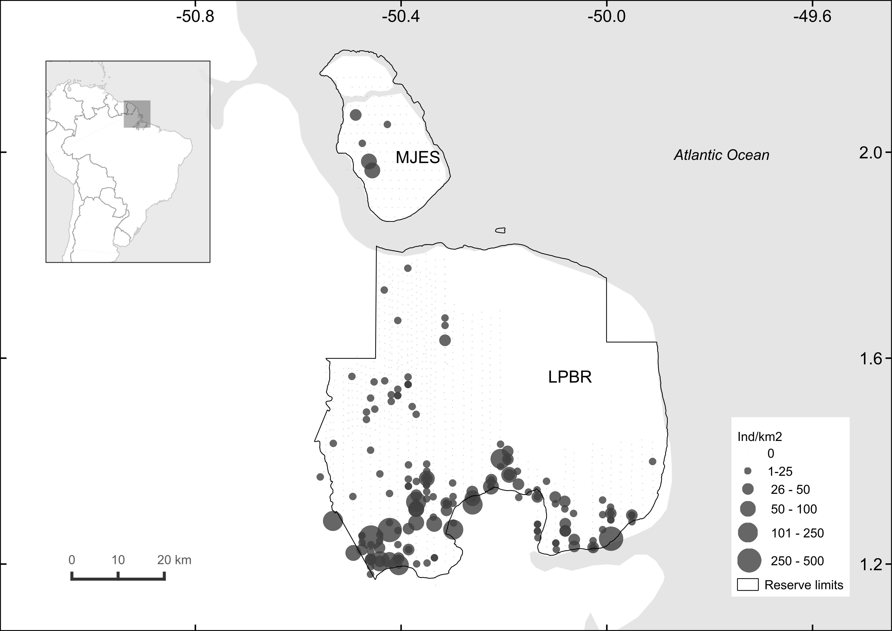

# Buffalo

Files for Management of Biological Invasions paper *Distribution and abundance of water buffalo populations in eastern Amazonian floodplains* by [Carvalho Jr et al. 2021](https://www.reabic.net/journals/mbi/2021/Accepted/MBI_2021_Carvalho_etal_correctedproof.pdf)

Aerial counts (double-count technique) conducted at Lago Piratuba Biological Reserve and Maracá-Jipioca Ecological Station in December 2017 by Elildo Carvalho Jr, Henrique Gonçalves, Iranildo Coutinho and Patricia Pinha.

### Description
```src``` Codes for running the analysis.

```data``` Raw and processed data from aerial surveys. 

```bin``` A bundle of useful codes needed to fix the raw data or functions that are called by the main analysis codes.

```results``` Results from the analysis such as tables, figures etc. 

#



**Figure 1.** Observed densities of buffalo at Lago Piratuba Biological Reserve and Maracá-Jipioca Ecological Station, Amapá, Brazil.


# Getting Started 
To run the codes in your computer, clone or download the entire repository and go straigth to *Part1-estimate-buffalo-population.R* in ```src``` folder.

# Setting up R locally
If you want to use R and haven't done so before, initial instructions for installing R, RStudio and Git (if desired) are below.
1. Install R: You can download the latest version of R [here](https://cran.rstudio.com).
2. Install Rstudio: [Rstudio Download link](https://www.rstudio.com/products/rstudio/download/)
3. Install Git: [See these installation notes](https://support.rstudio.com/hc/en-us/articles/200532077-Version-Control-with-Git-and-SVN) -  _only needed if you want to share your code with this repository and/or would like your local copy to stay updated as we add and improve code here_.
4. Clone or download this repository - _green button in top-right of this page_.

# Contact Us
If you have any questions please contact <elildojr@gmail.com>
