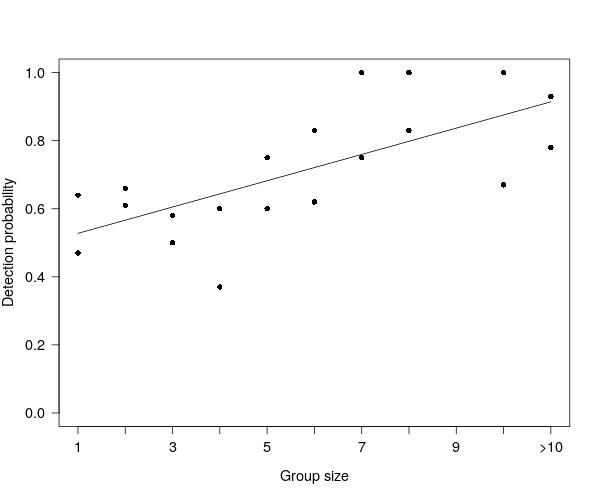

# Buffalo

Code to analyze data from aerial counts of buffaloes at Lago Piratuba Biological Reserve and Maracá-Jipioca Ecological Station.
By Elildo Carvalho Jr @ ICMBio/CENAP

Aerial counts (double-count technique) conducted in December 2017 by Elildo Carvalho Jr, Henrique Gonçalves, Iranildo Coutinho and Patricia Pinha.

**src** folder has the the code for running the analysis

**bin** has some functions called by the analysis code

**data** and **results** have guess what 

To run the codes in your computer, clone the entire repository and go straigth to *Part1-estimate-buffalo-population.R* in src code.

**Figure 1.** Observed densities of buffalo at Lago Piratuba Biological Reserve, Amapá.

**Figure 2.** Population trends: (a) Maracá-Jipioca and (b) Lago Piratuba. Estimates from 2007 and 2013 are from Tomas et al. (2008, 2014). (c) Herd trends for Amapá, Pracuúba and Tartarugalzinho. Data from IBGE.

**Figure 3.** Detection rates
